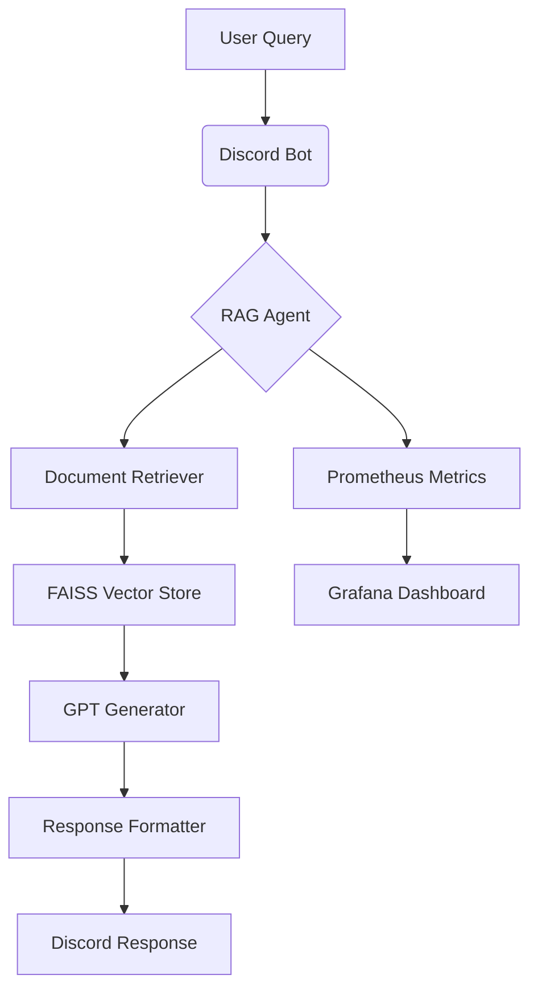

# Discord RAG Agent 🤖📚  
*Intelligent Document-Powered Assistant for Discord Servers*

  
*A smart assistant that answers questions based on your documents*

## 🌟 Key Features

| Feature | Description | Benefit |
|---------|-------------|---------|
| **Document Intelligence** | Answers questions using your knowledge base | No more digging through documents |
| **Smart Search** | FAISS vector search + MiniLM embeddings | Finds relevant info instantly |
| **AI-Powered Responses** | OpenRouter GPT integration | Natural, human-like answers |
| **Feedback System** | 👍/👎 reaction tracking | Continuously improves responses |
| **Production Monitoring** | Prometheus + Grafana integration | Track usage and performance |

## 🚀 Getting Started

### Prerequisites
1. **[Discord Bot Token](https://discord.com/developers/applications)**  
   (Create application → Bot → Copy Token)
2. **[OpenRouter API Key](https://openrouter.ai/keys)**  
   (Sign up → Create key)
3. **Python 3.10+** (with venv support)
4. **Docker** (optional but recommended)

### Installation Steps

```bash
# 1. Clone repository
git clone https://github.com/yourusername/discord-rag-agent.git
cd discord-rag-agent

# 2. Create virtual environment
python -m venv venv
source venv/bin/activate  # Linux/Mac
.\venv\Scripts\activate   # Windows

# 3. Install dependencies
pip install -r requirements.txt

# 4. Configure environment
cp .env.example .env
nano .env  # Fill in your credentials

# 5. Add knowledge documents
mkdir docs
echo "Your knowledge content here" > docs/knowledge.txt

# 6. Run the bot
python src/main.py
```

### Configuration (.env file)
```ini
# REQUIRED SETTINGS
DISCORD_TOKEN=your_bot_token_here
OPENROUTER_API_KEY=your_openrouter_key_here

# OPTIONAL SETTINGS
PROXY_URL=socks5://127.0.0.1:12334  # For proxy users
DOCS_DIR=./docs                      # Custom docs directory
CACHE_DIR=./cache                    # Embedding cache location
```

## 💻 Using the Bot

### Discord Commands
| Command | Example | Description |
|---------|---------|-------------|
| **`/ask [question]`** | `/ask "How does RAG work?"` | Get answers from your documents |
| **`/help`** | `/help` | Show help information |

### Additional Features
- **Mention Responses**: `@BotName Where are documents stored?`
- **Direct Messages**: Ask questions privately via DM
- **Feedback System**: React with 👍 or 👎 to rate answers
- **Auto-Processing**: Just add .txt files to `/docs` folder

## 🐳 Docker Deployment

### Simple Run (No Monitoring)
```bash
docker build -t rag-bot .
docker run -d -v ./docs:/app/docs --env-file .env rag-bot
```

### With Full Monitoring
```bash
# 1. First run to generate embeddings
python src/main.py

# 2. Start Prometheus (install first)
prometheus --config.file=prometheus.yml

# 3. Run Grafana and configure:
#    - Add Prometheus data source (http://localhost:9091)
#    - Import dashboard from grafana_dashboard.json

# 4. Start bot in production mode
python -u src/main.py
```

## 📊 Monitoring Setup

### Prometheus Configuration (`prometheus.yml`)
```yaml
global:
  scrape_interval: 15s

scrape_configs:
  - job_name: 'rag-bot'
    static_configs:
      - targets: ['localhost:9091']  # Docker: use host IP
```

## 📊 Grafana Dashboard Setup

### Dashboard JSON Export
We provide a pre-configured dashboard for monitoring your RAG bot. [Download the dashboard JSON here](Dashboard.json).


### Complete Dashboard Setup Guide

#### 1. Import the Dashboard
1. In Grafana, navigate to **Dashboards → Import**
2. Either:
   - Upload the JSON file
   - Paste the JSON content directly
   - Use dashboard ID `18983` (if published to Grafana)

#### 2. Configure Data Source
Ensure you have a Prometheus data source configured:
1. Go to **Configuration → Data Sources**
2. Add new **Prometheus** source
3. Set URL to `http://localhost:9091` (or your Prometheus server)
4. Save & Test

#### 3. Key Dashboard Features
- **Real-time Request Tracking**: Monitor QPS and total queries
- **Performance Metrics**: 
  - Average response latency
  - Error rates
- **User Feedback Analysis**: 
  - Positive/Negative ratio
  - Feedback trends over time
- **Resource Usage**:
  - Memory consumption
  - CPU load


### Troubleshooting Dashboard Issues
| Problem | Solution |
|---------|----------|
| No data showing | Check Prometheus is scraping the bot's metrics endpoint |
| "Invalid JSON" error | Validate your JSON at jsonlint.com |
| Missing metrics | Ensure bot is running with monitoring enabled |


### Available Metrics
- `request_count_total` - Total queries processed
- `query_latency_ms` - Response time in milliseconds
- `feedback_positive_total` - 👍 reactions received
- `feedback_negative_total` - 👎 reactions received
- `error_count_total` - Processing errors encountered

## ⚙️ Technical Architecture



## 🗂 Project Structure

```
discord-rag-agent/
├── src/                  # Source code
│   ├── bot/              # Discord integration
│   ├── rag/              # RAG implementation
│   ├── utils/            # Helper functions
│   └── main.py           # Application entry point
├── docs/                 # Knowledge base (.txt files)
├── cache/                # Embedding cache
├── tests/                # Unit tests
├── Dockerfile            # Container configuration
├── requirements.txt      # Python dependencies
├── .env                  # Environment configuration
└── prometheus.yml        # Monitoring setup
```

## 🔧 Troubleshooting

| Issue | Solution |
|-------|----------|
| **Bot not responding** | Check token permissions → Re-invite bot to server |
| **Slow first startup** | Normal - generating embeddings (subsequent starts faster) |
| **API connection errors** | System auto-retries 3 times with delay |
| **Long responses truncated** | Responses automatically split into multiple messages |
| **Missing documents** | Ensure files are in `/docs` with `.txt` extension |


## 📜 License

Distributed under the MIT License.
